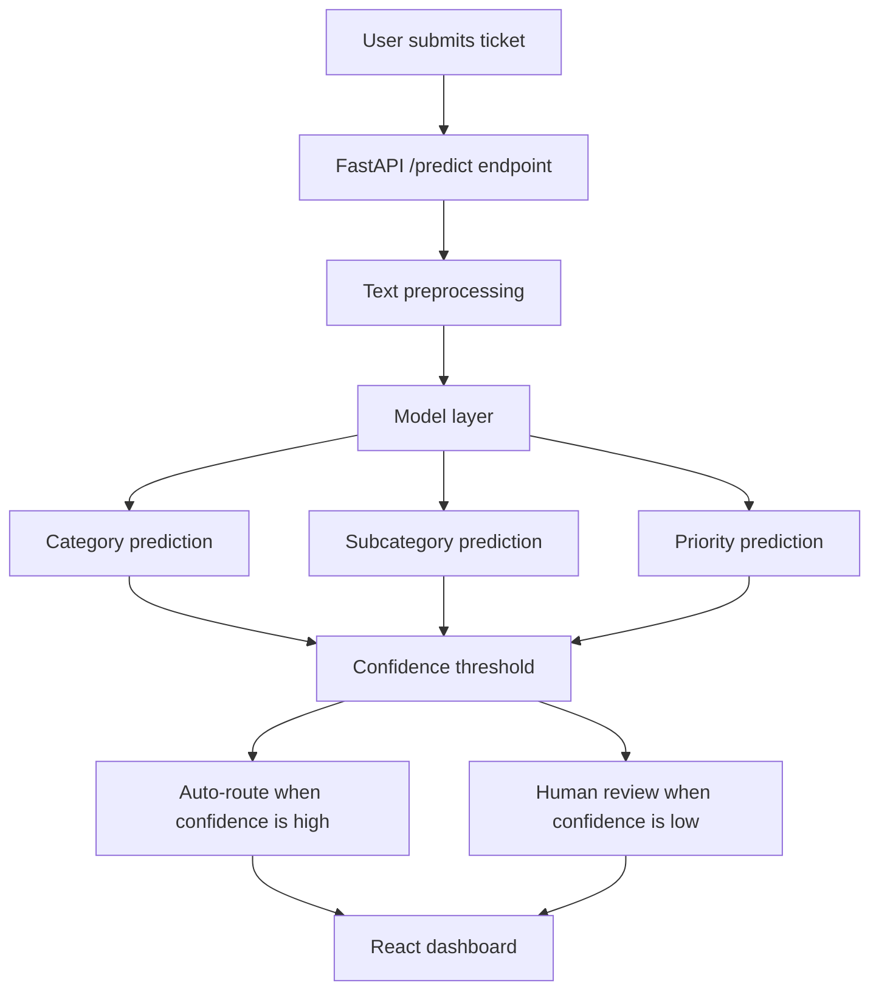

# Portfolio Case Study: IT Ticket Automation System

## Overview

This project is an end-to-end machine learning system for IT helpdesk ticket triage. It classifies noisy free-text support tickets into category, subcategory, and priority, then exposes predictions through a FastAPI backend and React dashboard.

## Problem

IT service desks receive large volumes of tickets such as:

- "VPN keeps disconnecting every few minutes."
- "Outlook crashes when opening attachments."
- "Printer says job completed but nothing printed."
- "Postgres database connection keeps timing out."

Manual triage slows response time, increases operational cost, and causes inconsistent routing. The goal is to automate the first-pass routing decision while sending low-confidence cases to human review.

## Dataset

The project uses a 20,000-row noisy synthetic IT helpdesk dataset. It includes:

- 9 high-level categories.
- 54 subcategories.
- 4 priority levels.
- Overlapping issue descriptions.
- Vague wording, typos, and misleading urgency phrases.
- Intentionally noisy category and subcategory labels.
- Hidden clean synthetic labels for benchmark comparison.

## Approach

The project compares multiple NLP strategies:

- TF-IDF + Logistic Regression.
- TF-IDF + LinearSVC.
- Sentence Transformers MiniLM embeddings + Logistic Regression.
- Sentence Transformers MiniLM embeddings + tuned XGBoost.
- Fine-tuned DistilBERT.

## Best Results

| Target | Best Model | Accuracy | Weighted F1 |
| --- | --- | ---: | ---: |
| Category | Fine-tuned DistilBERT | 81.35% | 82.45% |
| Subcategory | Fine-tuned DistilBERT | 76.82% | 79.77% |
| Priority | Fine-tuned DistilBERT | 44.70% | 34.01% |

Priority prediction is intentionally treated as experimental because ticket text alone does not reliably encode urgency. In production, priority should combine text with metadata such as impact, affected users, SLA, requester role, and service criticality.

## Architecture

## Production-Aware Routing

The API returns:

- Predicted category, subcategory, and priority.
- Confidence scores.
- `auto_route`.
- `needs_human_review`.
- `routing_decision`.
- `review_reason`.

Routing rule:

- Category confidence >= 70%: auto-route.
- Category confidence < 70%: human review.
- Subcategory confidence < 50%: treat subcategory as a suggestion.

## What Makes This Portfolio-Ready

- End-to-end ML workflow, not just a notebook.
- Noisy dataset with realistic ambiguity.
- Model benchmarking and transformer fine-tuning.
- API layer with confidence-aware routing.
- React dashboard with analytics and operational triage status.
- Research documentation and final model justification.

## Demo Script

This project automates IT helpdesk ticket triage. I started with a noisy synthetic dataset of 20,000 tickets containing overlapping categories and label noise. I benchmarked multiple NLP approaches including TF-IDF, Sentence Transformers with XGBoost, and DistilBERT fine-tuning. The best model was fine-tuned DistilBERT, reaching 81.35% category accuracy and 76.82% subcategory accuracy. Priority prediction was weaker, which makes sense because ticket text alone does not always contain enough urgency signal. The system includes a FastAPI backend, React dashboard, confidence scores, model training scripts, benchmark reports, and a full research write-up.

## Resume Bullet

Built an NLP-powered IT ticket triage system using TF-IDF baselines, Sentence Transformers, XGBoost, and fine-tuned DistilBERT; achieved 81.35% category accuracy and 76.82% subcategory accuracy on a noisy 20,000-ticket synthetic helpdesk dataset, with FastAPI inference, confidence-aware human-review routing, and a React analytics dashboard.
