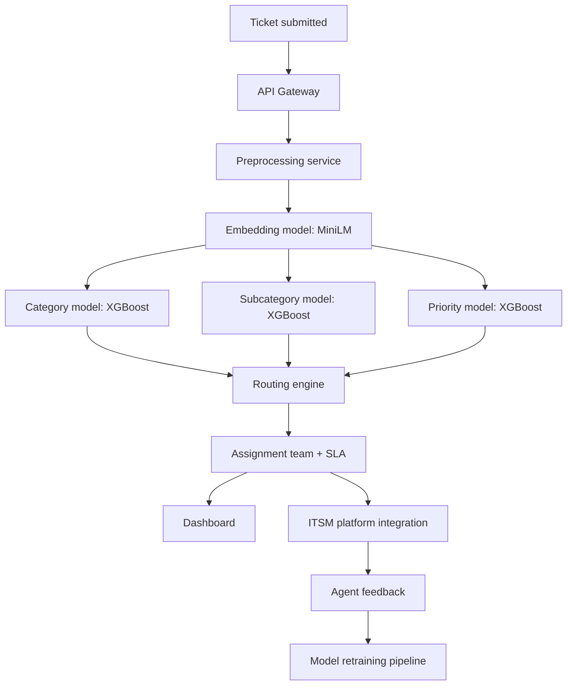

# IT Ticket Automated Classification System: Research Journey and Final Solution

This document explains the project as a complete research and engineering journey: starting from the business problem, comparing NLP approaches, reviewing relevant research, designing the dataset and pipeline, and ending with one concrete implementation recommendation.

## 1. Problem Research

### What IT Ticket Classification Means

IT ticket classification is the process of reading a free-text support request and predicting structured fields such as:

- Category: Network, Software, Hardware, Security, Access, Cloud, Database, Printer, Mobile Device.
- Subcategory: VPN, WiFi, Outlook, MFA, PostgreSQL, Printer Queue, iPhone, Laptop.
- Priority: Low, Medium, High, Critical.
- Assigned team: Network Support, Endpoint Support, Security Operations, Cloud Operations.

In a real service desk, this classification decides who receives the ticket, how quickly it must be handled, and what workflow starts next.

### Why Companies Care

Manual triage does not scale well. A human agent has to read every ticket, infer the issue, assign a category, decide priority, and route it to the right queue. When ticket volume grows, manual triage creates delay, inconsistent labeling, and misrouting.

Automated classification improves:

- First response time.
- Mean time to resolution.
- SLA compliance.
- Agent productivity.
- Routing consistency.
- Customer and employee satisfaction.
- Reporting quality.

### Where It Is Used

Ticket classification is used in:

- Enterprise IT support.
- Managed service providers.
- SaaS customer support.
- Telecom and cloud operations.
- Healthcare IT.
- Banking and insurance operations.
- Retail support desks.
- Internal HR, legal, finance, and facilities service desks.

### Enterprise Platform Context

Modern ITSM and support platforms already include workflow automation, queues, SLA tracking, knowledge bases, and AI-assisted routing. The project mirrors a smaller version of what these systems do.

- ServiceNow uses Predictive Intelligence and Now Assist-style capabilities for classification, routing, recommendations, and agent assistance.
- Jira Service Management supports request intake, queues, automation rules, SLAs, knowledge base suggestions, and multi-team workflows. Atlassian positions it as an ITSM platform for IT, HR, legal, and finance service teams.
- Zendesk provides intelligent triage features that infer intent, sentiment, and language so support teams can route and prioritize tickets.
- Freshdesk/Freshservice use Freddy AI and workflow automation for ticket handling, response assistance, and assignment.
- BMC Helix combines ITSM workflows with AIOps-style intelligence for enterprise service operations.
- ManageEngine ServiceDesk Plus supports request templates, business rules, SLAs, automation, and technician/group assignment.

The common pattern is:


## 2. Literature Review

### Findings From Research and Industry

| Source | Objective | Dataset | Methods | Results / Lessons | Limitations |
| --- | --- | --- | --- | --- | --- |
| [Classifying the Unstructured IT Service Desk Tickets Using Ensemble of Classifiers](https://arxiv.org/abs/2103.15822) | Classify IT service desk tickets to reduce wrong routing and reassignment. | Real enterprise IT service desk data. | Traditional classifiers and ensemble methods including bagging, boosting, and voting. | Ensembles improved over individual base classifiers; historical ticket text is useful for automated routing. | Enterprise datasets are usually private; results may depend heavily on label quality and company-specific queues. |
| [Ticket-BERT: Labeling Incident Management Tickets with Language Models](https://arxiv.org/abs/2307.00108) | Label incident tickets with fine-grained categories in a production incident management setting. | Microsoft incident-management ticket datasets. | BERT-style language models plus active learning. | Language models outperform weaker text baselines and active learning helps adapt to changing ticket labels. | Fine-tuning and production feedback loops require more infrastructure than a student project. |
| [AI-based Classification of Customer Support Tickets](https://arxiv.org/abs/2406.01789) | Evaluate AutoML for customer support ticket classification. | Customer support ticket data. | AutoML text classification workflow. | Shows that automated ML can produce useful ticket classifiers for teams without deep ML staffing. | AutoML may hide modeling decisions and can be harder to explain in a portfolio project. |
| [UFTR: A Unified Framework for Ticket Routing](https://arxiv.org/abs/2003.00703) | Route unresolved tickets to correct expert groups. | About half a million archived tickets. | Ranking models using ticket, group, and ticket-group interaction features. | Routing is not just text classification; assignment history and team interactions matter. | More complex than a first deployable project because it needs historical transfer data. |
| [TickIt: Leveraging Large Language Models for Automated Ticket Escalation](https://arxiv.org/abs/2504.08475) | Use LLMs for dynamic cloud-service ticket escalation. | ByteDance/Volcano Engine cloud support setting. | LLM-powered topic-aware escalation and relationship-driven routing. | LLMs are valuable for complex, evolving escalation workflows. | Higher cost, harder governance, and heavier production controls than a standard classifier. |
| [Azimuth: Systematic Error Analysis for Text Classification](https://arxiv.org/abs/2212.08216) | Improve text classifier error analysis. | General text classification workflows. | Error slicing, saliency, similarity, uncertainty, and behavioral analysis. | Error analysis should be treated as a core stage, not an afterthought. | It is tooling, not a ticket classifier by itself. |

### Research Trend

The trend is clear:

1. Traditional ML works surprisingly well when ticket labels are clean and categories are stable.
2. Ensembles improve accuracy but add training complexity.
3. Transformers improve semantic understanding, especially with messy text and abbreviations.
4. Full fine-tuning is strongest but needs more compute, monitoring, and data discipline.
5. Production routing often combines model predictions with business rules, SLAs, team availability, and confidence thresholds.

## 3. Dataset Investigation

### Public Dataset Reality

Public IT support datasets are limited because real tickets often contain names, emails, asset IDs, IP addresses, internal systems, security incidents, and customer data. Many public datasets are either too small, too generic, or focused on customer service rather than internal IT.

For this project, a synthetic dataset is acceptable because the goal is a portfolio-ready applied ML system. The synthetic data should still mimic real enterprise tickets:

- Typos: "outlookk", "passwrod", "prnter".
- Abbreviations: VPN, MFA, GCP, S3, EC2.
- Mixed casing.
- Missing fields.
- Noisy signatures.
- Error codes.
- Asset tags.
- Multiple date formats.
- Inconsistent labels.

### Current Dataset

The project now uses `data/tickets.csv`, a 20,000-row noisy/random synthetic IT helpdesk dataset. This version is intentionally harder than a simple keyword-generated dataset because category keywords are less direct, tickets can mention multiple issue types, and some labels are intentionally noisy.

Key fields:

- `ticket_id`
- `created_at`
- `ticket_text`
- `category`
- `subcategory`
- `true_category_hidden`
- `true_subcategory_hidden`
- `priority`
- `department`
- `user_role`
- `channel`
- `status`
- `impact`
- `response_time_hours`
- `resolution_time_hours`
- `label_quality`

Training uses only `ticket_text` as the NLP input and the visible `category`, `subcategory`, and `priority` labels as targets. The hidden true-label columns exist only to audit synthetic label noise and should not be used for normal training, because that would create evaluation leakage.

## 4. NLP Pipeline Research

### Data Cleaning Decision

Cleaning must improve signal without removing important IT terms.

| Step | Benefit | Risk | Decision |
| --- | --- | --- | --- |
| Lowercasing | Reduces vocabulary duplication. | Can lose acronym casing. | Use for model input; preserve labels separately. |
| Punctuation cleanup | Reduces noise like "??!!". | Some symbols matter in errors. | Remove heavy punctuation, keep useful characters like `#`, `.`, `+`, `-`. |
| Stopword removal | Can help bag-of-words models. | Short tickets often rely on context words. | Do not aggressively remove stopwords. |
| URL/email removal | Removes private/noisy tokens. | Rarely useful for category. | Remove or normalize in production. |
| Asset/error cleanup | Prevents memorizing IDs. | Error codes can be useful for support. | Remove generic asset tags; keep meaningful words around errors. |
| Label normalization | Fixes inconsistent targets. | Bad mappings can merge real classes. | Use explicit mappings for known messy labels. |

The implemented project uses shared preprocessing in `preprocessing.py`.

## 5. Text Representation Research

| Representation | How It Works | Pros | Cons | Suitability |
| --- | --- | --- | --- | --- |
| Bag of Words | Counts words. | Fast, simple, interpretable. | No semantics, large sparse vectors. | Good baseline only. |
| TF-IDF | Weights terms by frequency and rarity. | Strong baseline for support tickets. | Weak on paraphrases and misspellings. | Best traditional baseline. |
| Word2Vec | Learns word vectors from context. | Captures similarity between words. | Needs corpus quality; averages lose sentence meaning. | Useful but dated. |
| GloVe | Uses global co-occurrence statistics. | Good pretrained word vectors. | Weak for company-specific jargon. | Not ideal for modern pipeline. |
| FastText | Uses subword units. | Handles misspellings better. | Still weaker than sentence transformers. | Good for noisy text baseline. |
| Sentence Embeddings | Converts whole sentence to dense vector. | Captures semantic meaning; fast inference. | Less interpretable than TF-IDF. | Strong practical choice. |
| BERT Embeddings | Transformer contextual embeddings. | High semantic quality. | More compute and complexity. | Strong but heavier. |
| RoBERTa/DeBERTa | Optimized transformer variants. | High accuracy. | Higher memory and fine-tuning cost. | Enterprise-grade if compute exists. |
| DistilBERT/MiniLM | Smaller transformers. | Better latency/cost tradeoff. | Slightly less accurate than large models. | Best practical portfolio choice. |

## 6. Model Investigation

### Traditional ML

| Model | Strength | Weakness | Verdict |
| --- | --- | --- | --- |
| Naive Bayes | Very fast baseline. | Assumption too simple for nuanced tickets. | Keep as benchmark only. |
| Logistic Regression | Strong TF-IDF baseline, interpretable. | Needs feature engineering for semantic similarity. | Best traditional baseline. |
| SVM | Strong for text classification. | Slower probability calibration and scaling. | Good benchmark, less convenient for API confidence. |
| Random Forest | Handles nonlinear patterns. | Poor fit for high-dimensional sparse text. | Reject. |
| XGBoost | Strong tabular/embedding classifier. | More tuning and training cost. | Good with dense sentence embeddings. |

### Deep Learning

CNNs, RNNs, LSTMs, Bi-LSTMs, and GRUs can classify text, but they are no longer the most practical default for this project. They require more training work than classical ML and usually underperform transformers unless heavily tuned.

### Transformer Models

| Model | Accuracy Potential | Speed | Complexity | Verdict |
| --- | --- | --- | --- | --- |
| BERT fine-tuning | High | Medium/slow | High | Strong, but heavier than needed. |
| RoBERTa/DeBERTa | Very high | Slow | High | Best for enterprise accuracy experiments. |
| DistilBERT | High | Medium | Medium | Good if fine-tuning is required. |
| MiniLM Sentence Transformer | High enough | Fast | Medium-low | Best practical choice. |
| Large LLM | Very high for reasoning | Slow/costly | High governance burden | Use for response suggestions, not first classifier. |

## 7. Benchmarking Decision Matrix

These are expected relative rankings for this project type. Actual values should be recorded in `reports/metrics.csv` after running `python train.py`.

| Model | Accuracy | F1 | Speed | Memory | Complexity | Production Readiness |
| --- | --- | --- | --- | --- | --- | --- |
| Naive Bayes + TF-IDF | Medium | Medium | Very fast | Low | Low | Medium |
| Logistic Regression + TF-IDF | High baseline | High baseline | Very fast | Low | Low | High |
| Linear SVM + TF-IDF | High baseline | High baseline | Fast | Low-medium | Medium | Medium-high |
| Random Forest + TF-IDF | Medium | Medium | Medium | High | Medium | Low |
| XGBoost + TF-IDF | Medium-high | Medium-high | Medium | Medium-high | Medium | Medium |
| XGBoost + MiniLM embeddings | High | High | Fast inference | Medium | Medium | High |
| Fine-tuned DistilBERT | High | High | Medium | Medium-high | High | High |
| Fine-tuned RoBERTa/DeBERTa | Very high | Very high | Slow | High | High | Medium-high |
| LLM zero-shot | Variable | Variable | Slow | External/API cost | Medium-high | Medium |

Final ranking:

1. XGBoost + MiniLM sentence embeddings.
2. Logistic Regression + TF-IDF.
3. Fine-tuned DistilBERT.
4. Linear SVM + TF-IDF.
5. LLM-based zero-shot routing.

## 8. Error Analysis

Common misclassification patterns:

- VPN vs Network: VPN tickets are a network problem, but they may also be a subcategory.
- Outlook vs Email: Outlook is an application, but users describe it as email.
- Password Reset vs Access: Password reset and account access are closely related.
- Printer Queue vs Network Printer: The text may mention both "printer" and "network".
- Security vs Email: Phishing often arrives by email, so weak models may predict Email/Software.
- Cloud vs Database: "Postgres connection failing on AWS" can belong to Database or Cloud.

Production systems handle this with:

- Confidence thresholds.
- Top-k predictions.
- Human review queues for low confidence.
- Multi-label classification for ambiguous tickets.
- Business rules for high-risk categories.
- Feedback loops from final resolution groups.

## 9. Production Architecture



Components:

- FastAPI backend for prediction.
- Shared preprocessing module.
- Sentence Transformer embedding model.
- Three XGBoost classifiers.
- React dashboard.
- `reports/metrics.csv` for evaluation.
- `models/` artifacts for serving.

## 10. API Design

Current endpoint:

```http
POST /predict
```

Input:

```json
{
  "ticket_text": "Cannot connect to VPN after password reset"
}
```

Output:

```json
{
  "ticket_text": "Cannot connect to VPN after password reset",
  "category": "Network",
  "subcategory": "VPN",
  "priority": "High",
  "category_confidence": 0.94,
  "subcategory_confidence": 0.91,
  "priority_confidence": 0.87
}
```

Deployment options:

- Local: `uvicorn backend.app:app --reload --port 8000`
- Container: Docker image with model artifacts copied into `models/`.
- Cloud: AWS ECS/Fargate, Azure Container Apps, GCP Cloud Run.
- Enterprise: integrate the API with ServiceNow, Jira Service Management, Zendesk, or Freshservice through webhook/action automation.

## 11. Business Impact

Assumptions:

- 10,000 tickets per month.
- Manual triage takes 3 minutes per ticket.
- Automated classifier confidently routes 70% of tickets.
- Helpdesk triage labor cost is $35/hour.

Monthly manual triage time:

```text
10,000 tickets * 3 minutes = 30,000 minutes = 500 hours
```

Automated time saved:

```text
500 hours * 70% = 350 hours/month
```

Estimated labor savings:

```text
350 hours * $35/hour = $12,250/month
```

Annual estimate:

```text
$12,250 * 12 = $147,000/year
```

Additional value:

- Faster first response.
- Fewer reassignment loops.
- Better SLA compliance.
- More accurate analytics.
- Agents spend more time solving issues instead of sorting tickets.

## 12. Resume-Level Enhancements

Worth implementing:

- Priority prediction: already implemented.
- Analytics dashboard: already implemented.
- Confidence thresholds and top-k predictions.
- Suggested assigned team from model/rules.
- Batch prediction endpoint for CSV uploads.
- Error analysis notebook.
- Drift monitoring for label distribution changes.

Worth adding later:

- Ticket summarization.
- Duplicate ticket detection with embedding similarity.
- Retrieval-Augmented Generation for suggested responses.
- Human feedback loop for retraining.
- LLM-powered response drafting.

Not first priority:

- Fully agentic autonomous routing.
- Fine-tuned large transformer deployment.
- Complex UFTR-style group ranking without real transfer history.

## 13. Final Decision

### Winning Solution

Use **Sentence Transformers MiniLM embeddings + XGBoost classifiers + FastAPI + React**.

### Why It Wins

It provides the best balance for this project:

- Strong semantic understanding without full transformer fine-tuning.
- Fast enough for real-time API inference.
- Works well with messy short text.
- Easier to train than BERT/RoBERTa fine-tuning.
- More impressive than a plain TF-IDF tutorial.
- Practical for Colab training and GitHub portfolio review.

### Why Other Models Were Rejected

- Naive Bayes: too simple for a resume-grade project.
- Logistic Regression + TF-IDF: strong baseline, but less modern and less semantic.
- SVM: good accuracy, but less convenient confidence handling.
- Random Forest: not a good fit for sparse text.
- LSTM/GRU/CNN: unnecessary complexity for weaker practical payoff.
- Fine-tuned BERT/RoBERTa/DeBERTa: strong but heavier and harder to deploy.
- LLM-only classification: costly, slower, and less deterministic.

### What Different Teams Would Deploy

| Team | Best Choice |
| --- | --- |
| Large enterprise | Fine-tuned transformer plus rules, audit logs, feedback loop, and human review. |
| Startup | MiniLM embeddings plus XGBoost or Logistic Regression, deployed as a simple API. |
| College student | MiniLM embeddings plus XGBoost with clear metrics and dashboard. |
| This portfolio project | MiniLM + XGBoost + FastAPI + React + 20k noisy synthetic dataset. |

### Final Tech Stack

- Python
- pandas
- scikit-learn
- Sentence Transformers
- XGBoost
- FastAPI
- React
- Recharts
- Docker
- Google Colab for training

### Final Project Narrative

This is not just a classifier. It is an applied ITSM automation system that takes noisy free-text support tickets, cleans them, normalizes messy labels, embeds ticket descriptions with a transformer model, predicts category/subcategory/priority with XGBoost, and exposes the result through an API and dashboard.

That makes it suitable for:

- Resume projects.
- Internship applications.
- ML engineering portfolios.
- AI engineer portfolios.
- Software engineering portfolios with ML integration.

## Sources

- [Classifying the Unstructured IT Service Desk Tickets Using Ensemble of Classifiers](https://arxiv.org/abs/2103.15822)
- [Ticket-BERT: Labeling Incident Management Tickets with Language Models](https://arxiv.org/abs/2307.00108)
- [AI-based Classification of Customer Support Tickets](https://arxiv.org/abs/2406.01789)
- [UFTR: A Unified Framework for Ticket Routing](https://arxiv.org/abs/2003.00703)
- [TickIt: Leveraging Large Language Models for Automated Ticket Escalation](https://arxiv.org/abs/2504.08475)
- [Azimuth: Systematic Error Analysis for Text Classification](https://arxiv.org/abs/2212.08216)
- [Jira Service Management review and ITSM feature overview](https://www.techradar.com/reviews/jira-service-desk)
- [Freshworks/Freshdesk AI and support platform overview](https://www.techradar.com/reviews/freshdesk-crm-review)
